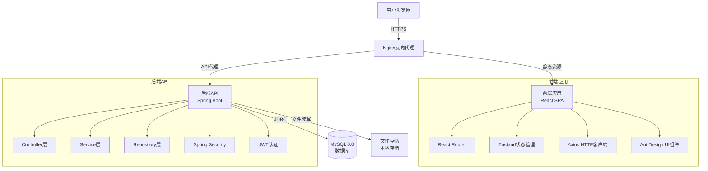
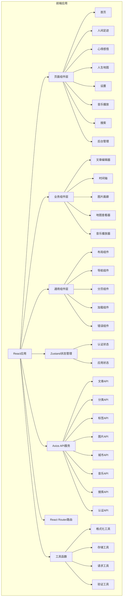

# 个人博客系统 - 架构设计文档

**版本**: v1.0.0  
**创建日期**: 2025-02-15  
**架构师**: Architect  
**PRD版本**: v1.0.0  
**状态**: 架构设计锁定

---

## 文档变更记录

| 版本 | 日期 | 变更内容 | 变更人 |
|------|------|----------|--------|
| v1.0.0 | 2025-02-15 | 初始版本创建 | Architect |

---

## 目录

1. [架构概述](#一架构概述)
2. [技术栈](#二技术栈)
3. [系统架构](#三系统架构)
4. [前端架构](#四前端架构)
5. [后端架构](#五后端架构)
6. [数据库设计](#六数据库设计)
7. [接口设计](#七接口设计)
8. [安全设计](#八安全设计)
9. [性能优化](#九性能优化)
10. [部署方案](#十部署方案)
11. [监控和运维](#十一监控和运维)
12. [附录](#十二附录)

---

## 一、架构概述

### 1.1 架构目标

- **可维护性**: 代码结构清晰，易于维护和扩展
- **可扩展性**: 支持未来功能扩展（如评论系统、RSS订阅）
- **高性能**: 满足100-500日均访问量的性能要求
- **高可用性**: 系统稳定可靠，减少故障时间
- **安全性**: 保障数据和系统安全

### 1.2 架构原则

- **前后端分离**: 前端和后端独立开发、部署
- **RESTful API**: 使用RESTful风格设计API
- **分层架构**: 后端采用分层架构（Controller-Service-Repository）
- **模块化设计**: 功能模块化，便于维护和扩展
- **容器化部署**: 使用Docker容器化部署

### 1.3 架构风格

- **架构模式**: 分层架构 + 前后端分离
- **部署模式**: 容器化部署 + 反向代理
- **数据存储**: 关系型数据库 + 文件系统存储
- **认证方式**: JWT无状态认证

---

## 二、技术栈

### 2.1 前端技术栈

| 技术类别 | 技术选型 | 版本 | 说明 |
|----------|----------|------|------|
| 框架 | React | 18.2 | 前端框架 |
| 语言 | TypeScript | 5.3 | 类型安全 |
| 构建工具 | Vite | 5.0 | 快速构建 |
| UI组件库 | Ant Design | 5.12 | 企业级UI组件 |
| CSS框架 | Tailwind CSS | 3.4 | 原子化CSS |
| 状态管理 | Zustand | 4.4 | 轻量级状态管理 |
| HTTP客户端 | Axios | 1.6 | HTTP请求 |
| 路由 | React Router | 6.21 | 前端路由 |
| 地图组件 | Leaflet | 1.9 | 开源地图组件 |
| 富文本编辑器 | Quill | 1.3 | 富文本编辑 |
| 代码高亮 | Prism.js | 1.29 | 代码高亮 |
| Markdown渲染 | React Markdown | 9.0 | Markdown渲染 |

### 2.2 后端技术栈

| 技术类别 | 技术选型 | 版本 | 说明 |
|----------|----------|------|------|
| 框架 | Spring Boot | 3.2.3 | 后端框架 |
| JDK | Java | 17 | Java开发环境 |
| ORM框架 | Spring Data JPA | 3.2.3 | 数据持久化 |
| 数据库 | MySQL | 8.0 | 关系型数据库 |
| 连接池 | HikariCP | 5.0 | 数据库连接池 |
| 安全框架 | Spring Security | 6.2 | 安全认证 |
| JWT库 | jjwt | 0.12 | JWT处理 |
| 工具库 | Lombok | 1.18.30 | 简化代码 |
| 工具库 | MapStruct | 1.5.5 | 对象映射 |
| 工具库 | Apache Commons | 3.14 | 通用工具 |
| 文档工具 | SpringDoc OpenAPI | 2.3 | API文档 |
| 验证框架 | Hibernate Validator | 8.0 | 参数验证 |

### 2.3 部署技术栈

| 技术类别 | 技术选型 | 版本 | 说明 |
|----------|----------|------|------|
| 容器化 | Docker | 24.0 | 容器化部署 |
| 容器编排 | Docker Compose | 2.21 | 多容器编排 |
| 反向代理 | Nginx | 1.25 | 反向代理 |
| SSL证书 | Let's Encrypt | - | 免费SSL证书 |
| 进程管理 | Docker | - | 容器进程管理 |

### 2.4 开发工具栈

| 工具类别 | 工具选型 | 版本 | 说明 |
|----------|----------|------|------|
| 包管理器 | npm | 10.2 | 前端包管理 |
| 包管理器 | Maven | 3.9 | 后端包管理 |
| 代码编辑器 | VS Code | - | 推荐IDE |
| 版本控制 | Git | - | 版本控制 |
| API测试 | Postman | - | API测试工具 |
| 数据库管理 | MySQL Workbench | - | 数据库管理 |

---

## 三、系统架构

### 3.1 系统架构图



### 3.2 系统架构说明

#### 3.2.1 架构层次

系统采用**前后端分离架构**，分为以下层次：

1. **用户层**: 用户浏览器
2. **网关层**: Nginx反向代理
3. **应用层**: 前端应用 + 后端API
4. **数据层**: MySQL数据库 + 文件存储

#### 3.2.2 数据流向

**前台访问流程**:
```
用户浏览器 → Nginx → 前端应用 → 后端API → MySQL数据库
                              ↓
                         文件存储
```

**后台管理流程**:
```
用户浏览器 → Nginx → 前端应用 → 后端API → MySQL数据库
                              ↓
                         文件存储
```

#### 3.2.3 部署架构

```
┌─────────────────────────────────────────────────────────┐
│                  个人服务器                        │
├─────────────────────────────────────────────────────────┤
│  ┌───────────────────────────────────────────────┐  │
│  │              Docker网络                    │  │
│  │  ┌─────────┐  ┌─────────┐  ┌─────────┐ │  │
│  │  │ Nginx   │  │ 前端    │  │ 后端    │ │  │
│  │  │ 容器    │  │ 容器    │  │ 容器    │ │  │
│  │  │ :80/443 │  │ :3000   │  │ :8080   │ │  │
│  │  └─────────┘  └─────────┘  └─────────┘ │  │
│  └───────────────────────────────────────────────┘  │
│                                                     │
│  ┌───────────────────────────────────────────────┐  │
│  │              数据存储                    │  │
│  │  ┌─────────┐  ┌─────────┐             │  │
│  │  │ MySQL   │  │ 文件存储 │             │  │
│  │  │ 数据库  │  │ 目录     │             │  │
│  │  │ :3306   │  │ /data    │             │  │
│  │  └─────────┘  └─────────┘             │  │
│  └───────────────────────────────────────────────┘  │
└─────────────────────────────────────────────────────────┘
```

### 3.3 端口规划

| 服务 | 端口 | 说明 |
|------|------|------|
| Nginx | 80, 443 | HTTP/HTTPS |
| 前端应用 | 3000 | 开发环境 |
| 后端API | 8080 | 后端API |
| MySQL | 3306 | 数据库 |

---

## 四、前端架构

### 4.1 前端架构图



### 4.2 前端目录结构

```
frontend/
├── public/                 # 静态资源
│   ├── images/            # 图片资源
│   └── favicon.ico        # 网站图标
├── src/
│   ├── api/              # API服务层
│   │   ├── article.ts     # 文章API
│   │   ├── category.ts    # 分类API
│   │   ├── tag.ts        # 标签API
│   │   ├── image.ts       # 图片API
│   │   ├── city.ts       # 城市API
│   │   ├── music.ts      # 音乐API
│   │   ├── search.ts     # 搜索API
│   │   └── auth.ts       # 认证API
│   ├── assets/            # 资源文件
│   │   ├── images/       # 图片资源
│   │   └── styles/       # 样式资源
│   ├── components/        # 组件层
│   │   ├── common/       # 通用组件
│   │   │   ├── Layout.tsx
│   │   │   ├── Navigation.tsx
│   │   │   ├── Pagination.tsx
│   │   │   ├── Loading.tsx
│   │   │   └── ErrorBoundary.tsx
│   │   └── business/     # 业务组件
│   │       ├── ArticleEditor.tsx
│   │       ├── Timeline.tsx
│   │       ├── ImageGallery.tsx
│   │       ├── MapViewer.tsx
│   │       └── MusicPlayer.tsx
│   ├── hooks/             # 自定义Hooks
│   │   ├── useAuth.ts
│   │   ├── useDebounce.ts
│   │   └── usePagination.ts
│   ├── layouts/           # 布局组件
│   │   ├── FrontLayout.tsx
│   │   └── AdminLayout.tsx
│   ├── pages/             # 页面组件
│   │   ├── front/        # 前台页面
│   │   │   ├── Home.tsx
│   │   │   ├── Gallery.tsx
│   │   │   ├── Article.tsx
│   │   │   ├── ArticleDetail.tsx
│   │   │   ├── Map.tsx
│   │   │   ├── Settings.tsx
│   │   │   ├── Music.tsx
│   │   │   └── Search.tsx
│   │   └── admin/       # 后台页面
│   │       ├── Login.tsx
│   │       ├── Dashboard.tsx
│   │       ├── ArticleList.tsx
│   │       ├── ArticleEditor.tsx
│   │       ├── CategoryManage.tsx
│   │       ├── TagManage.tsx
│   │       ├── ImageManage.tsx
│   │       ├── CityManage.tsx
│   │       ├── Settings.tsx
│   │       └── Stats.tsx
│   ├── router/            # 路由配置
│   │   └── index.tsx
│   ├── stores/            # 状态管理
│   │   ├── authStore.ts
│   │   └── appStore.ts
│   ├── types/             # TypeScript类型定义
│   │   ├── article.ts
│   │   ├── category.ts
│   │   ├── tag.ts
│   │   ├── image.ts
│   │   ├── city.ts
│   │   ├── music.ts
│   │   └── api.ts
│   ├── utils/             # 工具函数
│   │   ├── format.ts
│   │   ├── storage.ts
│   │   ├── request.ts
│   │   └── validation.ts
│   ├── constants/         # 常量定义
│   │   └── index.ts
│   ├── App.tsx            # 应用根组件
│   ├── main.tsx           # 应用入口
│   └── index.css          # 全局样式
├── .env.example          # 环境变量示例
├── .eslintrc.cjs        # ESLint配置
├── .prettierrc          # Prettier配置
├── package.json          # 项目配置
├── tsconfig.json        # TypeScript配置
├── vite.config.ts       # Vite配置
└── Dockerfile           # Docker镜像构建
```

### 4.3 前端技术实现

#### 4.3.1 路由设计

**路由配置**:
```typescript
// 前台路由
/                          → 首页
/gallery                   → 人间足迹
/article                    → 心得感悟
/article/:id               → 文章详情
/map                       → 人生地图
/settings                  → 设置
/music                     → 音乐播放
/search                    → 搜索

// 后台路由
/admin                     → 后台首页
/admin/login                → 登录
/admin/articles             → 文章管理
/admin/articles/:id/edit    → 文章编辑
/admin/categories           → 分类管理
/admin/tags               → 标签管理
/admin/images              → 图片管理
/admin/cities             → 城市管理
/admin/settings           → 系统设置
/admin/stats              → 访问统计
```

**路由守卫**:
- 后台路由需要认证
- 未认证用户重定向到登录页
- 已认证用户重定向到后台首页

#### 4.3.2 状态管理

**状态管理方案**: Zustand

**状态划分**:
```typescript
// 认证状态
interface AuthState {
  user: User | null;
  token: string | null;
  isAuthenticated: boolean;
  login: (username: string, password: string) => Promise<void>;
  logout: () => void;
}

// 应用状态
interface AppState {
  theme: 'light' | 'dark';
  language: string;
  settings: SystemSettings;
  setTheme: (theme: 'light' | 'dark') => void;
  setLanguage: (language: string) => void;
  updateSettings: (settings: Partial<SystemSettings>) => void;
}
```

#### 4.3.3 API服务设计

**API服务层**:
```typescript
// 请求封装
interface ApiResponse<T> {
  code: number;
  message: string;
  data: T;
}

interface PageResult<T> {
  list: T[];
  total: number;
  page: number;
  pageSize: number;
  totalPages: number;
}

// API服务示例
class ArticleService {
  static async getArticles(params: GetArticlesParams): Promise<ApiResponse<PageResult<Article>>> {
    return request.get('/api/articles', { params });
  }
  
  static async getArticleById(id: number): Promise<ApiResponse<Article>> {
    return request.get(`/api/articles/${id}`);
  }
  
  static async createArticle(data: CreateArticleDto): Promise<ApiResponse<Article>> {
    return request.post('/api/articles', data);
  }
  
  static async updateArticle(id: number, data: UpdateArticleDto): Promise<ApiResponse<void>> {
    return request.put(`/api/articles/${id}`, data);
  }
  
  static async deleteArticle(id: number): Promise<ApiResponse<void>> {
    return request.delete(`/api/articles/${id}`);
  }
}
```

#### 4.3.4 组件设计

**组件层次**:
```
Layout组件
  ├─ Navigation组件
  ├─ 路由出口
  └─ Footer组件

页面组件
  ├─ 业务组件
  └─ 通用组件
```

**组件通信**:
- Props传递：父组件向子组件传递数据
- Context：跨组件共享状态
- Zustand：全局状态管理
- Event Bus：组件间事件通信

---

## 五、后端架构

### 5.1 后端架构图

```mermaid
graph TB
    subgraph 后端API
        App[Spring Boot应用]
        
        App --> Controller[Controller层]
        App --> Service[Service层]
        App --> Repository[Repository层]
        App --> Security[安全层]
        App --> Exception[异常处理]
        App --> Config[配置层]
        
        Controller --> AuthController[认证控制器]
        Controller --> ArticleController[文章控制器]
        Controller --> CategoryController[分类控制器]
        Controller --> TagController[标签控制器]
        Controller --> ImageController[图片控制器]
        Controller --> CityController[城市控制器]
        Controller --> MusicController[音乐控制器]
        Controller --> SettingsController[设置控制器]
        Controller --> StatsController[统计控制器]
        Controller --> SearchController[搜索控制器]
        Controller --> BackupController[备份控制器]
        
        Service --> AuthService[认证服务]
        Service --> ArticleService[文章服务]
        Service --> CategoryService[分类服务]
        Service --> TagService[标签服务]
        Service --> ImageService[图片服务]
        Service --> CityService[城市服务]
        Service --> MusicService[音乐服务]
        Service --> SettingsService[设置服务]
        Service --> StatsService[统计服务]
        Service --> SearchService[搜索服务]
        Service --> BackupService[备份服务]
        
        Repository --> AdminRepository[管理员仓库]
        Repository --> ArticleRepository[文章仓库]
        Repository --> CategoryRepository[分类仓库]
        Repository --> TagRepository[标签仓库]
        Repository --> ArticleTagRepository[文章标签仓库]
        Repository --> ImageRepository[图片仓库]
        Repository --> CityRepository[城市仓库]
        Repository --> MusicRepository[音乐仓库]
        Repository --> SystemSettingRepository[设置仓库]
        Repository --> VisitStatRepository[统计仓库]
        Repository --> InspirationRepository[灵感仓库]
        
        Security --> JWTFilter[JWT过滤器]
        Security --> SecurityConfig[安全配置]
        Security --> JWTUtil[JWT工具]
        
        Exception --> GlobalExceptionHandler[全局异常处理]
        Exception --> BusinessException[业务异常]
        
        Config --> DatabaseConfig[数据库配置]
        Config --> SecurityConfig[安全配置]
        Config --> WebConfig[Web配置]
        Config --> FileConfig[文件配置]
    end
```



### 5.2 后端目录结构

```
backend/
├── src/
│   ├── main/
│   │   ├── java/
│   │   │   └── com/
│   │   │       └── blog/
│   │   │           ├── BlogApplication.java          # 应用启动类
│   │   │           ├── common/                   # 通用模块
│   │   │           │   ├── Result.java            # 统一响应结果
│   │   │           │   ├── PageResult.java        # 分页响应结果
│   │   │           │   └── ErrorCode.java        # 错误码定义
│   │   │           ├── config/                   # 配置模块
│   │   │           │   ├── DatabaseConfig.java   # 数据库配置
│   │   │           │   ├── SecurityConfig.java   # 安全配置
│   │   │           │   ├── WebConfig.java       # Web配置
│   │   │           │   └── FileConfig.java      # 文件配置
│   │   │           ├── controller/               # 控制器层
│   │   │           │   ├── AuthController.java
│   │   │           │   ├── ArticleController.java
│   │   │           │   ├── CategoryController.java
│   │   │           │   ├── TagController.java
│   │   │           │   ├── ImageController.java
│   │   │           │   ├── CityController.java
│   │   │           │   ├── MusicController.java
│   │   │           │   ├── SettingsController.java
│   │   │           │   ├── StatsController.java
│   │   │           │   ├── SearchController.java
│   │   │           │   └── BackupController.java
│   │   │           ├── dto/                     # 数据传输对象
│   │   │           │   ├── request/            # 请求DTO
│   │   │           │   │   ├── LoginRequest.java
│   │   │           │   │   ├── ArticleCreateRequest.java
│   │   │           │   │   ├── ArticleUpdateRequest.java
│   │   │           │   │   ├── CategoryRequest.java
│   │   │           │   │   ├── TagRequest.java
│   │   │           │   │   └── ...
│   │   │           │   └── response/           # 响应DTO
│   │   │           │       ├── LoginResponse.java
│   │   │           │       ├── ArticleResponse.java
│   │   │           │       ├── CategoryResponse.java
│   │   │           │       └── ...
│   │   │           ├── entity/                   # 实体类
│   │   │           │   ├── Admin.java
│   │   │           │   ├── Article.java
│   │   │           │   ├── Category.java
│   │   │           │   ├── Tag.java
│   │   │           │   ├── ArticleTag.java
│   │   │           │   ├── Image.java
│   │   │           │   ├── City.java
│   │   │           │   ├── Music.java
│   │   │           │   ├── SystemSetting.java
│   │   │           │   ├── VisitStat.java
│   │   │           │   └── Inspiration.java
│   │   │           ├── exception/                # 异常处理
│   │   │           │   ├── BusinessException.java
│   │   │           │   ├── ErrorCode.java
│   │   │           │   └── GlobalExceptionHandler.java
│   │   │           ├── filter/                   # 过滤器
│   │   │           │   └── JwtFilter.java
│   │   │           ├── repository/               # 数据访问层
│   │   │           │   ├── AdminRepository.java
│   │   │           │   ├── ArticleRepository.java
│   │   │           │   ├── CategoryRepository.java
│   │   │           │   ├── TagRepository.java
│   │   │           │   ├── ArticleTagRepository.java
│   │   │           │   ├── ImageRepository.java
│   │   │           │   ├── CityRepository.java
│   │   │           │   ├── MusicRepository.java
│   │   │           │   ├── SystemSettingRepository.java
│   │   │           │   ├── VisitStatRepository.java
│   │   │           │   └── InspirationRepository.java
│   │   │           ├── service/                  # 服务层
│   │   │           │   ├── AuthService.java
│   │   │           │   ├── ArticleService.java
│   │   │           │   ├── CategoryService.java
│   │   │           │   ├── TagService.java
│   │   │           │   ├── ImageService.java
│   │   │           │   ├── CityService.java
│   │   │           │   ├── MusicService.java
│   │   │           │   ├── SettingsService.java
│   │   │           │   ├── StatsService.java
│   │   │           │   ├── SearchService.java
│   │   │           │   └── BackupService.java
│   │   │           └── util/                    # 工具类
│   │   │               ├── JwtUtil.java
│   │   │               ├── FileUtil.java
│   │   │               └── SlugUtil.java
│   │   └── resources/
│   │       ├── application.yml           # 主配置文件
│   │       ├── application-dev.yml       # 开发环境配置
│   │       ├── application-prod.yml      # 生产环境配置
│   │       └── db/
│   │           └── migration/          # 数据库迁移脚本
│   └── test/
│       └── java/                      # 测试代码
├── pom.xml                           # Maven配置文件
└── Dockerfile                        # Docker镜像构建
```

### 5.3 后端技术实现

#### 5.3.1 分层架构

**Controller层**:
- 职责：接收HTTP请求，参数验证，调用Service层
- 特点：薄层，不包含业务逻辑

**Service层**:
- 职责：业务逻辑处理，事务管理
- 特点：核心业务逻辑层

**Repository层**:
- 职责：数据访问，与数据库交互
- 特点：使用Spring Data JPA

#### 5.3.2 统一响应格式

```java
@Data
public class Result<T> {
    private Integer code;
    private String message;
    private T data;
    
    public static <T> Result<T> success(T data) {
        Result<T> result = new Result<>();
        result.setCode(200);
        result.setMessage("success");
        result.setData(data);
        return result;
    }
    
    public static <T> Result<T> error(ErrorCode errorCode) {
        Result<T> result = new Result<>();
        result.setCode(errorCode.getCode());
        result.setMessage(errorCode.getMessage());
        return result;
    }
}
```

#### 5.3.3 异常处理

```java
@RestControllerAdvice
public class GlobalExceptionHandler {
    
    @ExceptionHandler(BusinessException.class)
    public Result<?> handleBusinessException(BusinessException e) {
        return Result.error(e.getErrorCode());
    }
    
    @ExceptionHandler(Exception.class)
    public Result<?> handleException(Exception e) {
        log.error("系统异常", e);
        return Result.error(ErrorCode.SYSTEM_ERROR);
    }
}
```

#### 5.3.4 安全认证

**JWT认证流程**:
```
1. 用户登录 → 验证账号密码
2. 生成JWT Token → 返回给前端
3. 前端存储Token → 每次请求携带Token
4. 后端验证Token → 解析用户信息
5. 执行业务逻辑 → 返回结果
```

**JWT配置**:
```java
@Configuration
@EnableWebSecurity
public class SecurityConfig {
    
    @Bean
    public SecurityFilterChain filterChain(HttpSecurity http) throws Exception {
        http.csrf().disable()
            .sessionManagement().sessionCreationPolicy(SessionCreationPolicy.STATELESS)
            .authorizeHttpRequests()
                .requestMatchers("/api/auth/**").permitAll()
                .requestMatchers("/api/articles", "/api/categories", "/api/tags").permitAll()
                .anyRequest().authenticated()
            .and()
            .addFilterBefore(jwtFilter, UsernamePasswordAuthenticationFilter.class);
        return http.build();
    }
}
```

---

## 六、数据库设计

### 6.1 数据库选型

**数据库**: MySQL 8.0

**选型理由**:
- ✅ 开源免费，降低成本
- ✅ 性能优秀，满足100-500日均访问量
- ✅ 技术成熟，社区活跃
- ✅ 与Spring Boot集成良好
- ✅ 支持全文搜索
- ✅ 支持事务，保证数据一致性

### 6.2 数据库配置

**连接池配置**:
```yaml
spring:
  datasource:
    url: jdbc:mysql://localhost:3306/blog_db
    username: blog_user
    password: ${DB_PASSWORD}
    driver-class-name: com.mysql.cj.jdbc.Driver
    hikari:
      maximum-pool-size: 10
      minimum-idle: 5
      connection-timeout: 30000
      idle-timeout: 600000
      max-lifetime: 1800000
```

**JPA配置**:
```yaml
spring:
  jpa:
    hibernate:
      ddl-auto: validate
    show-sql: false
    properties:
      hibernate:
        dialect: org.hibernate.dialect.MySQL8Dialect
        format_sql: true
```

### 6.3 数据表设计

#### 6.3.1 管理员表 (admin)

```sql
CREATE TABLE admin (
    id BIGINT AUTO_INCREMENT PRIMARY KEY,
    username VARCHAR(50) NOT NULL UNIQUE,
    password VARCHAR(255) NOT NULL,
    email VARCHAR(100),
    created_at DATETIME NOT NULL DEFAULT CURRENT_TIMESTAMP,
    updated_at DATETIME NOT NULL DEFAULT CURRENT_TIMESTAMP ON UPDATE CURRENT_TIMESTAMP,
    INDEX idx_username (username)
) ENGINE=InnoDB DEFAULT CHARSET=utf8mb4 COLLATE=utf8mb4_unicode_ci;
```

#### 6.3.2 文章表 (article)

```sql
CREATE TABLE article (
    id BIGINT AUTO_INCREMENT PRIMARY KEY,
    title VARCHAR(200) NOT NULL,
    slug VARCHAR(200) NOT NULL UNIQUE,
    content TEXT NOT NULL,
    summary TEXT,
    status ENUM('draft', 'published', 'archived') NOT NULL DEFAULT 'draft',
    category_id BIGINT,
    author_id BIGINT NOT NULL,
    view_count INT NOT NULL DEFAULT 0,
    publish_time DATETIME,
    created_at DATETIME NOT NULL DEFAULT CURRENT_TIMESTAMP,
    updated_at DATETIME NOT NULL DEFAULT CURRENT_TIMESTAMP ON UPDATE CURRENT_TIMESTAMP,
    INDEX idx_slug (slug),
    INDEX idx_status (status),
    INDEX idx_category_id (category_id),
    INDEX idx_author_id (author_id),
    INDEX idx_publish_time (publish_time),
    FULLTEXT INDEX ft_content (title, content),
    FOREIGN KEY (category_id) REFERENCES category(id) ON DELETE SET NULL,
    FOREIGN KEY (author_id) REFERENCES admin(id) ON DELETE CASCADE
) ENGINE=InnoDB DEFAULT CHARSET=utf8mb4 COLLATE=utf8mb4_unicode_ci;
```

#### 6.3.3 分类表 (category)

```sql
CREATE TABLE category (
    id BIGINT AUTO_INCREMENT PRIMARY KEY,
    name VARCHAR(50) NOT NULL UNIQUE,
    slug VARCHAR(50) NOT NULL UNIQUE,
    description TEXT,
    created_at DATETIME NOT NULL DEFAULT CURRENT_TIMESTAMP,
    updated_at DATETIME NOT NULL DEFAULT CURRENT_TIMESTAMP ON UPDATE CURRENT_TIMESTAMP,
    INDEX idx_slug (slug)
) ENGINE=InnoDB DEFAULT CHARSET=utf8mb4 COLLATE=utf8mb4_unicode_ci;
```

#### 6.3.4 标签表 (tag)

```sql
CREATE TABLE tag (
    id BIGINT AUTO_INCREMENT PRIMARY KEY,
    name VARCHAR(50) NOT NULL UNIQUE,
    slug VARCHAR(50) NOT NULL UNIQUE,
    created_at DATETIME NOT NULL DEFAULT CURRENT_TIMESTAMP,
    updated_at DATETIME NOT NULL DEFAULT CURRENT_TIMESTAMP ON UPDATE CURRENT_TIMESTAMP,
    INDEX idx_slug (slug)
) ENGINE=InnoDB DEFAULT CHARSET=utf8mb4 COLLATE=utf8mb4_unicode_ci;
```

#### 6.3.5 文章标签关联表 (article_tag)

```sql
CREATE TABLE article_tag (
    article_id BIGINT NOT NULL,
    tag_id BIGINT NOT NULL,
    PRIMARY KEY (article_id, tag_id),
    INDEX idx_article_id (article_id),
    INDEX idx_tag_id (tag_id),
    FOREIGN KEY (article_id) REFERENCES article(id) ON DELETE CASCADE,
    FOREIGN KEY (tag_id) REFERENCES tag(id) ON DELETE CASCADE
) ENGINE=InnoDB DEFAULT CHARSET=utf8mb4 COLLATE=utf8mb4_unicode_ci;
```

#### 6.3.6 图片表 (image)

```sql
CREATE TABLE image (
    id BIGINT AUTO_INCREMENT PRIMARY KEY,
    filename VARCHAR(255) NOT NULL,
    url VARCHAR(500) NOT NULL,
    location VARCHAR(100),
    taken_at DATE,
    description TEXT,
    sort_order INT NOT NULL DEFAULT 0,
    created_at DATETIME NOT NULL DEFAULT CURRENT_TIMESTAMP,
    updated_at DATETIME NOT NULL DEFAULT CURRENT_TIMESTAMP ON UPDATE CURRENT_TIMESTAMP,
    INDEX idx_sort_order (sort_order),
    FULLTEXT INDEX ft_description (description)
) ENGINE=InnoDB DEFAULT CHARSET=utf8mb4 COLLATE=utf8mb4_unicode_ci;
```

#### 6.3.7 城市表 (city)

```sql
CREATE TABLE city (
    id BIGINT AUTO_INCREMENT PRIMARY KEY,
    name VARCHAR(50) NOT NULL,
    latitude DECIMAL(10,8) NOT NULL,
    longitude DECIMAL(11,8) NOT NULL,
    visit_count INT NOT NULL DEFAULT 1,
    first_visit DATE NOT NULL,
    notes TEXT,
    created_at DATETIME NOT NULL DEFAULT CURRENT_TIMESTAMP,
    updated_at DATETIME NOT NULL DEFAULT CURRENT_TIMESTAMP ON UPDATE CURRENT_TIMESTAMP,
    INDEX idx_name (name),
    INDEX idx_location (latitude, longitude)
) ENGINE=InnoDB DEFAULT CHARSET=utf8mb4 COLLATE=utf8mb4_unicode_ci;
```

#### 6.3.8 音乐表 (music)

```sql
CREATE TABLE music (
    id BIGINT AUTO_INCREMENT PRIMARY KEY,
    title VARCHAR(200) NOT NULL,
    artist VARCHAR(100) NOT NULL,
    album VARCHAR(200),
    duration INT NOT NULL,
    url VARCHAR(500) NOT NULL,
    cover_url VARCHAR(500),
    sort_order INT NOT NULL DEFAULT 0,
    created_at DATETIME NOT NULL DEFAULT CURRENT_TIMESTAMP,
    updated_at DATETIME NOT NULL DEFAULT CURRENT_TIMESTAMP ON UPDATE CURRENT_TIMESTAMP,
    INDEX idx_sort_order (sort_order)
) ENGINE=InnoDB DEFAULT CHARSET=utf8mb4 COLLATE=utf8mb4_unicode_ci;
```

#### 6.3.9 系统设置表 (system_setting)

```sql
CREATE TABLE system_setting (
    id BIGINT AUTO_INCREMENT PRIMARY KEY,
    `key` VARCHAR(50) NOT NULL UNIQUE,
    value TEXT NOT NULL,
    description VARCHAR(255),
    updated_at DATETIME NOT NULL DEFAULT CURRENT_TIMESTAMP ON UPDATE CURRENT_TIMESTAMP,
    INDEX idx_key (`key`)
) ENGINE=InnoDB DEFAULT CHARSET=utf8mb4 COLLATE=utf8mb4_unicode_ci;
```

#### 6.3.10 访问统计表 (visit_stat)

```sql
CREATE TABLE visit_stat (
    id BIGINT AUTO_INCREMENT PRIMARY KEY,
    visit_date DATE NOT NULL UNIQUE,
    page_views INT NOT NULL DEFAULT 0,
    unique_visitors INT NOT NULL DEFAULT 0,
    created_at DATETIME NOT NULL DEFAULT CURRENT_TIMESTAMP,
    updated_at DATETIME NOT NULL DEFAULT CURRENT_TIMESTAMP ON UPDATE CURRENT_TIMESTAMP,
    INDEX idx_visit_date (visit_date)
) ENGINE=InnoDB DEFAULT CHARSET=utf8mb4 COLLATE=utf8mb4_unicode_ci;
```

#### 6.3.11 灵感表 (inspiration)

```sql
CREATE TABLE inspiration (
    id BIGINT AUTO_INCREMENT PRIMARY KEY,
    content TEXT NOT NULL,
    article_id BIGINT,
    category VARCHAR(50),
    created_at DATETIME NOT NULL DEFAULT CURRENT_TIMESTAMP,
    updated_at DATETIME NOT NULL DEFAULT CURRENT_TIMESTAMP ON UPDATE CURRENT_TIMESTAMP,
    INDEX idx_article_id (article_id),
    INDEX idx_category (category),
    FOREIGN KEY (article_id) REFERENCES article(id) ON DELETE SET NULL
) ENGINE=InnoDB DEFAULT CHARSET=utf8mb4 COLLATE=utf8mb4_unicode_ci;
```

### 6.4 数据库索引设计

**索引策略**:
- 主键索引：所有表的主键自动创建索引
- 唯一索引：username, slug等唯一字段
- 普通索引：外键、查询频繁的字段
- 全文索引：title, content, description等需要全文搜索的字段

**索引列表**:
```sql
-- 文章表索引
CREATE INDEX idx_article_status ON article(status);
CREATE INDEX idx_article_category ON article(category_id);
CREATE INDEX idx_article_author ON article(author_id);
CREATE INDEX idx_article_publish_time ON article(publish_time);
CREATE FULLTEXT INDEX ft_article_content ON article(title, content);

-- 图片表索引
CREATE INDEX idx_image_sort ON image(sort_order);
CREATE FULLTEXT INDEX ft_image_description ON image(description);

-- 城市表索引
CREATE INDEX idx_city_name ON city(name);
CREATE INDEX idx_city_location ON city(latitude, longitude);

-- 访问统计表索引
CREATE INDEX idx_visit_date ON visit_stat(visit_date);
```

---

## 七、接口设计

### 7.1 接口规范

#### 7.1.1 通用规范

- **协议**: HTTPS
- **数据格式**: JSON
- **字符编码**: UTF-8
- **请求方法**: GET, POST, PUT, DELETE
- **认证方式**: JWT Token

#### 7.1.2 统一响应格式

```json
{
  "code": 200,
  "message": "success",
  "data": {}
}
```

**字段说明**:
- `code`: 状态码（200成功，其他为错误码）
- `message`: 响应消息
- `data`: 响应数据

#### 7.1.3 分页响应格式

```json
{
  "code": 200,
  "message": "success",
  "data": {
    "list": [],
    "total": 100,
    "page": 1,
    "pageSize": 10,
    "totalPages": 10
  }
}
```

### 7.2 接口列表

#### 7.2.1 认证接口

| 接口名称 | 方法 | 路径 | 说明 |
|----------|------|------|------|
| 登录 | POST | /api/auth/login | 用户登录 |
| 登出 | POST | /api/auth/logout | 用户登出 |

#### 7.2.2 文章接口

| 接口名称 | 方法 | 路径 | 说明 |
|----------|------|------|------|
| 获取文章列表 | GET | /api/articles | 分页获取文章 |
| 获取文章详情 | GET | /api/articles/{id} | 获取单篇文章 |
| 创建文章 | POST | /api/articles | 创建新文章 |
| 更新文章 | PUT | /api/articles/{id} | 更新文章 |
| 删除文章 | DELETE | /api/articles/{id} | 删除文章 |

#### 7.2.3 分类接口

| 接口名称 | 方法 | 路径 | 说明 |
|----------|------|------|------|
| 获取分类列表 | GET | /api/categories | 获取所有分类 |
| 创建分类 | POST | /api/categories | 创建新分类 |

#### 7.2.4 标签接口

| 接口名称 | 方法 | 路径 | 说明 |
|----------|------|------|------|
| 获取标签列表 | GET | /api/tags | 获取所有标签 |
| 创建标签 | POST | /api/tags | 创建新标签 |

#### 7.2.5 图片接口

| 接口名称 | 方法 | 路径 | 说明 |
|----------|------|------|------|
| 获取图片列表 | GET | /api/images | 分页获取图片 |
| 上传图片 | POST | /api/images/upload | 上传图片 |
| 更新图片 | PUT | /api/images/{id} | 更新图片信息 |
| 删除图片 | DELETE | /api/images/{id} | 删除图片 |

#### 7.2.6 城市接口

| 接口名称 | 方法 | 路径 | 说明 |
|----------|------|------|------|
| 获取城市列表 | GET | /api/cities | 获取所有城市 |
| 创建城市 | POST | /api/cities | 创建新城市 |

#### 7.2.7 音乐接口

| 接口名称 | 方法 | 路径 | 说明 |
|----------|------|------|------|
| 获取音乐列表 | GET | /api/music | 获取所有音乐 |

#### 7.2.8 系统设置接口

| 接口名称 | 方法 | 路径 | 说明 |
|----------|------|------|------|
| 获取系统设置 | GET | /api/settings | 获取系统设置 |
| 更新系统设置 | PUT | /api/settings | 更新系统设置 |

#### 7.2.9 访问统计接口

| 接口名称 | 方法 | 路径 | 说明 |
|----------|------|------|------|
| 获取访问统计 | GET | /api/stats | 获取访问统计数据 |

#### 7.2.10 备份接口

| 接口名称 | 方法 | 路径 | 说明 |
|----------|------|------|------|
| 创建备份 | POST | /api/backup | 创建系统备份 |

#### 7.2.11 搜索接口

| 接口名称 | 方法 | 路径 | 说明 |
|----------|------|------|------|
| 搜索 | GET | /api/search | 全文搜索 |

### 7.3 接口安全

#### 7.3.1 认证接口

- `/api/auth/login`: 无需认证
- `/api/auth/logout`: 需要认证

#### 7.3.2 公开接口

- `/api/articles` (GET): 公开
- `/api/articles/{id}` (GET): 公开
- `/api/categories` (GET): 公开
- `/api/tags` (GET): 公开
- `/api/images` (GET): 公开
- `/api/cities` (GET): 公开
- `/api/music` (GET): 公开
- `/api/settings` (GET): 公开
- `/api/search` (GET): 公开

#### 7.3.3 需要认证的接口

- `/api/articles` (POST, PUT, DELETE): 需要认证
- `/api/categories` (POST, PUT, DELETE): 需要认证
- `/api/tags` (POST, PUT, DELETE): 需要认证
- `/api/images` (POST, PUT, DELETE): 需要认证
- `/api/cities` (POST, PUT, DELETE): 需要认证
- `/api/settings` (PUT): 需要认证
- `/api/stats` (GET): 需要认证
- `/api/backup` (POST): 需要认证

---

## 八、安全设计

### 8.1 认证安全

#### 8.1.1 密码加密

**加密算法**: BCrypt

**实现方式**:
```java
@Service
public class AuthService {
    
    public String encryptPassword(String rawPassword) {
        return BCrypt.hashpw(rawPassword, BCrypt.gensalt());
    }
    
    public boolean checkPassword(String rawPassword, String encodedPassword) {
        return BCrypt.checkpw(rawPassword, encodedPassword);
    }
}
```

#### 8.1.2 JWT认证

**JWT配置**:
```yaml
jwt:
  secret: ${JWT_SECRET:your-secret-key}
  expiration: 86400000 # 24小时
```

**JWT生成**:
```java
public String generateToken(User user) {
    Date now = new Date();
    Date expiryDate = new Date(now.getTime() + jwtExpiration);
    
    return Jwts.builder()
        .setSubject(user.getUsername())
        .setIssuedAt(now)
        .setExpiration(expiryDate)
        .signWith(SignatureAlgorithm.HS512, jwtSecret)
        .compact();
}
```

**JWT验证**:
```java
public boolean validateToken(String token) {
    try {
        Jwts.parser()
            .setSigningKey(jwtSecret)
            .parseClaimsJws(token)
            .getBody();
        return true;
    } catch (JwtException | IllegalArgumentException e) {
        return false;
    }
}
```

### 8.2 数据安全

#### 8.2.1 SQL注入防护

**防护措施**:
- 使用Spring Data JPA，自动参数化查询
- 避免SQL拼接
- 输入验证

**示例**:
```java
// 安全的参数化查询
@Query("SELECT a FROM Article a WHERE a.category.id = :categoryId")
List<Article> findByCategoryId(@Param("categoryId") Long categoryId);

// 不安全的SQL拼接（禁止）
// String sql = "SELECT * FROM article WHERE category_id = " + categoryId;
```

#### 8.2.2 XSS防护

**防护措施**:
- 输入验证：验证用户输入
- 输出编码：HTML编码
- 内容安全策略：配置CSP头部

**示例**:
```java
// 输入验证
@NotBlank(message = "标题不能为空")
@Size(max = 200, message = "标题长度不能超过200")
private String title;

// 输出编码（前端）
<div dangerouslySetInnerHTML={{{__html: escapeHtml(content)}}} />
```

#### 8.2.3 CSRF防护

**防护措施**:
- 使用JWT无状态认证，天然防御CSRF
- 配置CSRF Token（可选）

**配置**:
```java
@Configuration
public class SecurityConfig {
    
    @Bean
    public SecurityFilterChain filterChain(HttpSecurity http) throws Exception {
        http.csrf().disable() // JWT认证可以禁用CSRF
            .sessionManagement().sessionCreationPolicy(SessionCreationPolicy.STATELESS)
            .authorizeHttpRequests()
                .anyRequest().authenticated();
        return http.build();
    }
}
```

### 8.3 文件上传安全

#### 8.3.1 文件类型验证

**验证规则**:
```java
private static final List<String> ALLOWED_IMAGE_TYPES = Arrays.asList(
    "image/jpeg",
    "image/png",
    "image/gif",
    "image/webp"
);

public boolean isValidImageType(MultipartFile file) {
    String contentType = file.getContentType();
    return ALLOWED_IMAGE_TYPES.contains(contentType);
}
```

#### 8.3.2 文件大小限制

**配置**:
```yaml
spring:
  servlet:
    multipart:
      max-file-size: 5MB
      max-request-size: 10MB
```

**验证**:
```java
public void uploadImage(MultipartFile file) {
    if (file.getSize() > 5 * 1024 * 1024) {
        throw new BusinessException(ErrorCode.FILE_TOO_LARGE);
    }
    // 上传逻辑
}
```

### 8.4 系统安全

#### 8.4.1 HTTPS配置

**Nginx配置**:
```nginx
server {
    listen 443 ssl http2;
    server_name your-domain.com;
    
    ssl_certificate /etc/letsencrypt/live/your-domain.com/fullchain.pem;
    ssl_certificate_key /etc/letsencrypt/live/your-domain.com/privkey.pem;
    ssl_protocols TLSv1.2 TLSv1.3;
    ssl_ciphers HIGH:!aNULL:!MD5;
    
    location / {
        proxy_pass http://backend:8080;
        proxy_set_header Host $host;
        proxy_set_header X-Real-IP $remote_addr;
        proxy_set_header X-Forwarded-For $proxy_add_x_forwarded_for;
        proxy_set_header X-Forwarded-Proto $scheme;
    }
}

server {
    listen 80;
    server_name your-domain.com;
    return 301 https://$server_name$request_uri;
}
```

#### 8.4.2 安全头部

**配置**:
```java
@Configuration
public class WebConfig implements WebMvcConfigurer {
    
    @Override
    public void addCorsMappings(CorsRegistry registry) {
        registry.addMapping("/**")
            .allowedOrigins("https://your-domain.com")
            .allowedMethods("GET", "POST", "PUT", "DELETE")
            .allowedHeaders("*")
            .allowCredentials(true)
            .maxAge(3600);
    }
}
```

---

## 九、性能优化

### 9.1 前端性能优化

#### 9.1.1 代码分割

**实现方式**: Vite动态导入

**示例**:
```typescript
// 路由懒加载
const Home = lazy(() => import('./pages/front/Home'));
const Gallery = lazy(() => import('./pages/front/Gallery'));
const Article = lazy(() => import('./pages/front/Article'));

// 组件懒加载
const MapViewer = lazy(() => import('./components/business/MapViewer'));
```

#### 9.1.2 图片优化

**优化策略**:
- 使用WebP格式
- 压缩图片
- 响应式图片
- 懒加载

**实现**:
```typescript
// 图片懒加载
import { useEffect, useState, useRef } from 'react';

function LazyImage({ src, alt }: ImageProps) {
  const [isVisible, setIsVisible] = useState(false);
  const imgRef = useRef<HTMLImageElement>(null);
  
  useEffect(() => {
    const observer = new IntersectionObserver((entries) => {
      entries.forEach(entry => {
        if (entry.isIntersecting) {
          setIsVisible(true);
        }
      });
    });
    
    if (imgRef.current) {
      observer.observe(imgRef.current);
    }
    
    return () => observer.disconnect();
  }, []);
  
  return (
    
  );
}
```

#### 9.1.3 缓存策略

**Service Worker**:
```typescript
// service-worker.ts
self.addEventListener('install', (event) => {
  event.waitUntil(
    caches.open('blog-v1').then((cache) => {
      return cache.addAll([
        '/',
        '/static/css/main.css',
        '/static/js/main.js',
      ]);
    })
  );
});

self.addEventListener('fetch', (event) => {
  event.respondWith(
    caches.match(event.request).then((response) => {
      return response || fetch(event.request);
    })
  );
});
```

### 9.2 后端性能优化

#### 9.2.1 数据库优化

**索引优化**:
```sql
-- 添加索引
CREATE INDEX idx_article_status ON article(status);
CREATE INDEX idx_article_publish_time ON article(publish_time);
CREATE FULLTEXT INDEX ft_article_content ON article(title, content);
```

**查询优化**:
```java
// 避免N+1查询
@Entity
@NamedEntityGraph(name = "article-with-category", attributePaths = {"category", "tags"})
public class Article {
    // ...
}

// 使用EntityGraph
@EntityGraph(value = "article-with-category")
List<Article> findAll();
```

#### 9.2.2 缓存机制

**Redis缓存**（可选）:
```java
@Service
public class ArticleService {
    
    @Cacheable(value = "articles", key = "#id")
    public Article getArticleById(Long id) {
        return articleRepository.findById(id).orElse(null);
    }
    
    @CacheEvict(value = "articles", key = "#article.id")
    public Article updateArticle(Article article) {
        return articleRepository.save(article);
    }
    
    @CacheEvict(value = "articles", allEntries = true)
    public void deleteArticle(Long id) {
        articleRepository.deleteById(id);
    }
}
```

#### 9.2.3 连接池优化

**HikariCP配置**:
```yaml
spring:
  datasource:
    hikari:
      maximum-pool-size: 10
      minimum-idle: 5
      connection-timeout: 30000
      idle-timeout: 600000
      max-lifetime: 1800000
```

### 9.3 数据库性能优化

#### 9.3.1 查询优化

**优化策略**:
- 使用索引
- 避免SELECT *
- 使用LIMIT分页
- 优化JOIN查询

**示例**:
```java
// 优化前
@Query("SELECT a FROM Article a")
List<Article> findAll();

// 优化后
@Query("SELECT a FROM Article a WHERE a.status = :status ORDER BY a.publishTime DESC")
Page<Article> findByStatus(@Param("status") String status, Pageable pageable);
```

#### 9.3.2 数据归档

**归档策略**:
- 定期归档历史数据
- 减少主表数据量
- 提高查询性能

**实现**:
```java
@Scheduled(cron = "0 0 2 * * ?") // 每天凌晨2点执行
public void archiveOldArticles() {
    LocalDate oneYearAgo = LocalDate.now().minusYears(1);
    List<Article> oldArticles = articleRepository
        .findByPublishTimeBeforeAndStatus(oneYearAgo, "published");
    
    oldArticles.forEach(article -> {
        article.setStatus("archived");
        articleRepository.save(article);
    });
}
```

---

## 十、部署方案

### 10.1 Docker部署

#### 10.1.1 前端Dockerfile

```dockerfile
# 构建阶段
FROM node:18-alpine AS builder
WORKDIR /app
COPY package*.json ./
RUN npm ci
COPY . .
RUN npm run build

# 生产阶段
FROM nginx:alpine
COPY --from=builder /app/dist /usr/share/nginx/html
COPY nginx.conf /etc/nginx/nginx.conf
EXPOSE 80
CMD ["nginx", "-g", "daemon off;"]
```

#### 10.1.2 后端Dockerfile

```dockerfile
FROM openjdk:17-jdk-alpine
WORKDIR /app
COPY target/blog-backend.jar app.jar
EXPOSE 8080
ENTRYPOINT ["java", "-jar", "app.jar"]
```

#### 10.1.3 Docker Compose配置

```yaml
version: '3.8'

services:
  nginx:
    image: nginx:alpine
    ports:
      - "80:80"
      - "443:443"
    volumes:
      - ./nginx/nginx.conf:/etc/nginx/nginx.conf
      - ./nginx/ssl:/etc/nginx/ssl
      - ./data/uploads:/usr/share/nginx/html/uploads
    depends_on:
      - frontend
      - backend
    networks:
      - blog-network

  frontend:
    build:
      context: ./frontend
      dockerfile: Dockerfile
    ports:
      - "3000:80"
    networks:
      - blog-network

  backend:
    build:
      context: ./backend
      dockerfile: Dockerfile
    ports:
      - "8080:8080"
    environment:
      - SPRING_PROFILES_ACTIVE=prod
      - DB_HOST=mysql
      - DB_PORT=3306
      - DB_NAME=blog_db
      - DB_USERNAME=blog_user
      - DB_PASSWORD=${DB_PASSWORD}
      - JWT_SECRET=${JWT_SECRET}
    volumes:
      - ./data/uploads:/app/uploads
      - ./data/backups:/app/backups
    depends_on:
      - mysql
    networks:
      - blog-network

  mysql:
    image: mysql:8.0
    ports:
      - "3306:3306"
    environment:
      - MYSQL_ROOT_PASSWORD=${MYSQL_ROOT_PASSWORD}
      - MYSQL_DATABASE=blog_db
      - MYSQL_USER=blog_user
      - MYSQL_PASSWORD=${MYSQL_PASSWORD}
    volumes:
      - ./data/mysql:/var/lib/mysql
      - ./sql/init.sql:/docker-entrypoint-initdb.d/init.sql
    networks:
      - blog-network

networks:
  blog-network:
    driver: bridge

volumes:
  mysql-data:
  uploads-data:
  backups-data:
```

### 10.2 Nginx配置

#### 10.2.1 Nginx主配置

```nginx
user nginx;
worker_processes auto;
error_log /var/log/nginx/error.log warn;
pid /var/run/nginx.pid;

events {
    worker_connections 1024;
}

http {
    include /etc/nginx/mime.types;
    default_type application/octet-stream;
    
    log_format main '$remote_addr - $remote_user [$time_local] "$request" '
                    '$status $body_bytes_sent "$http_referer" '
                    '"$http_user_agent"';
    
    access_log /var/log/nginx/access.log main;
    
    sendfile on;
    tcp_nopush on;
    tcp_nodelay on;
    keepalive_timeout 65;
    types_hash_max_size 2048;
    
    include /etc/nginx/conf.d/*.conf;
    
    server {
        listen 80;
        server_name your-domain.com;
        return 301 https://$server_name$request_uri;
    }
    
    server {
        listen 443 ssl http2;
        server_name your-domain.com;
        
        ssl_certificate /etc/nginx/ssl/fullchain.pem;
        ssl_certificate_key /etc/nginx/ssl/privkey.pem;
        ssl_protocols TLSv1.2 TLSv1.3;
        ssl_ciphers HIGH:!aNULL:!MD5;
        ssl_prefer_server_ciphers on;
        
        root /usr/share/nginx/html;
        index index.html;
        
        # 静态资源缓存
        location ~* \.(jpg|jpeg|png|gif|ico|css|js)$ {
            expires 1y;
            add_header Cache-Control "public, immutable";
        }
        
        # 前端路由
        location / {
            try_files $uri $uri/ /index.html;
        }
        
        # API代理
        location /api/ {
            proxy_pass http://backend:8080;
            proxy_set_header Host $host;
            proxy_set_header X-Real-IP $remote_addr;
            proxy_set_header X-Forwarded-For $proxy_add_x_forwarded_for;
            proxy_set_header X-Forwarded-Proto $scheme;
            proxy_connect_timeout 300s;
            proxy_send_timeout 300s;
            proxy_read_timeout 300s;
        }
        
        # 文件上传
        location /uploads/ {
            alias /usr/share/nginx/html/uploads;
            client_max_body_size 10M;
        }
        
        # Gzip压缩
        gzip on;
        gzip_vary on;
        gzip_min_length 1024;
        gzip_types text/plain text/css text/xml text/javascript application/x-javascript application/xml+rss application/json;
    }
}
```

### 10.3 SSL证书配置

#### 10.3.1 Let's Encrypt证书

**获取证书**:
```bash
# 安装Certbot
sudo apt-get install certbot python3-certbot-nginx

# 获取证书
sudo certbot --nginx -d your-domain.com

# 自动续期
sudo certbot renew --dry-run
```

**自动续期**:
```bash
# 添加定时任务
sudo crontab -e

# 每天凌晨3点检查并续期
0 3 * * * /usr/bin/certbot renew --quiet --post-hook "systemctl reload nginx"
```

### 10.4 部署流程

#### 10.4.1 首次部署

```bash
# 1. 克隆代码
git clone <repository-url>
cd personal-blog

# 2. 配置环境变量
cp .env.example .env
vim .env

# 3. 构建并启动
docker-compose up -d --build

# 4. 初始化数据库
docker-compose exec mysql mysql -u blog_user -p blog_db < sql/init.sql

# 5. 配置SSL证书
sudo certbot --nginx -d your-domain.com

# 6. 验证部署
curl https://your-domain.com
```

#### 10.4.2 更新部署

```bash
# 1. 拉取最新代码
git pull origin main

# 2. 重新构建并启动
docker-compose up -d --build

# 3. 数据库迁移（如需要）
docker-compose exec backend java -jar app.jar --migrate
```

---

## 十一、监控和运维

### 11.1 日志管理

#### 11.1.1 应用日志

**日志配置**:
```yaml
logging:
  level:
    root: INFO
    com.blog: DEBUG
  pattern:
    console: "%d{yyyy-MM-dd HH:mm:ss} [%thread] %-5level %logger{36} - %msg%n"
  file:
    name: logs/blog.log
    max-size: 10MB
    max-history: 30
```

#### 11.1.2 Nginx日志

**日志配置**:
```nginx
access_log /var/log/nginx/access.log main;
error_log /var/log/nginx/error.log warn;
```

### 11.2 备份策略

#### 11.2.1 数据库备份

**备份脚本**:
```bash
#!/bin/bash
DATE=$(date +%Y%m%d_%H%M%S)
BACKUP_DIR="/data/backups"
MYSQL_CONTAINER="mysql"

# 备份数据库
docker exec $MYSQL_CONTAINER mysqldump -u blog_user -p${MYSQL_PASSWORD} blog_db > $BACKUP_DIR/blog_db_$DATE.sql

# 压缩备份文件
gzip $BACKUP_DIR/blog_db_$DATE.sql

# 删除30天前的备份
find $BACKUP_DIR -name "blog_db_*.sql.gz" -mtime +30 -delete
```

**定时备份**:
```bash
# 添加定时任务（每天凌晨2点备份）
0 2 * * * /path/to/backup-script.sh
```

#### 11.2.2 文件备份

**备份脚本**:
```bash
#!/bin/bash
DATE=$(date +%Y%m%d_%H%M%S)
BACKUP_DIR="/data/backups"
UPLOADS_DIR="/data/uploads"

# 备份上传文件
tar -czf $BACKUP_DIR/uploads_$DATE.tar.gz $UPLOADS_DIR

# 删除30天前的备份
find $BACKUP_DIR -name "uploads_*.tar.gz" -mtime +30 -delete
```

### 11.3 监控指标

#### 11.3.1 应用监控

**监控指标**:
- 应用启动状态
- API响应时间
- 错误率
- 数据库连接数
- 内存使用率

**监控工具**:
- Spring Boot Actuator
- Prometheus + Grafana（可选）

**Actuator配置**:
```yaml
management:
  endpoints:
    web:
      exposure:
        include: health,info,metrics
  endpoint:
    health:
      show-details: always
```

#### 11.3.2 系统监控

**监控指标**:
- CPU使用率
- 内存使用率
- 磁盘使用率
- 网络流量

**监控工具**:
- htop
- iotop
- nethogs

---

## 十二、附录

### 12.1 技术文档

#### 12.1.1 API文档

**文档工具**: SpringDoc OpenAPI

**访问地址**: http://your-domain.com/api/swagger-ui.html

**配置**:
```yaml
springdoc:
  api-docs:
    path: /api-docs
  swagger-ui:
    path: /swagger-ui.html
  packages-to-scan: com.blog.controller
```

### 12.2 开发规范

#### 12.2.1 代码规范

**前端代码规范**:
- 使用TypeScript类型检查
- 使用ESLint代码检查
- 使用Prettier代码格式化
- 遵循React最佳实践

**后端代码规范**:
- 遵循阿里巴巴Java开发手册
- 使用Checkstyle代码检查
- 使用SonarQube代码质量分析
- 遵循Spring Boot最佳实践

#### 12.2.2 Git规范

**分支策略**:
- main: 主分支，生产环境
- develop: 开发分支
- feature/*: 功能分支
- bugfix/*: 修复分支

**提交规范**:
- feat: 新功能
- fix: 修复bug
- docs: 文档更新
- style: 代码格式调整
- refactor: 重构
- test: 测试相关
- chore: 构建/工具相关

### 12.3 版本管理

#### 12.3.1 版本号规则

**版本格式**: v主版本.次版本.修订版本

**版本示例**:
- v1.0.0: 初始版本
- v1.0.1: 修复bug
- v1.1.0: 新增功能
- v2.0.0: 重大更新

#### 12.3.2 发布流程

1. 开发功能
2. 代码审查
3. 合并到develop
4. 测试验证
5. 合并到main
6. 打标签
7. 部署上线

---

## 文档结束

*本架构设计文档基于PRD v1.0.0生成，包含完整的系统架构、技术栈、数据库设计、接口设计、安全设计、性能优化和部署方案。*